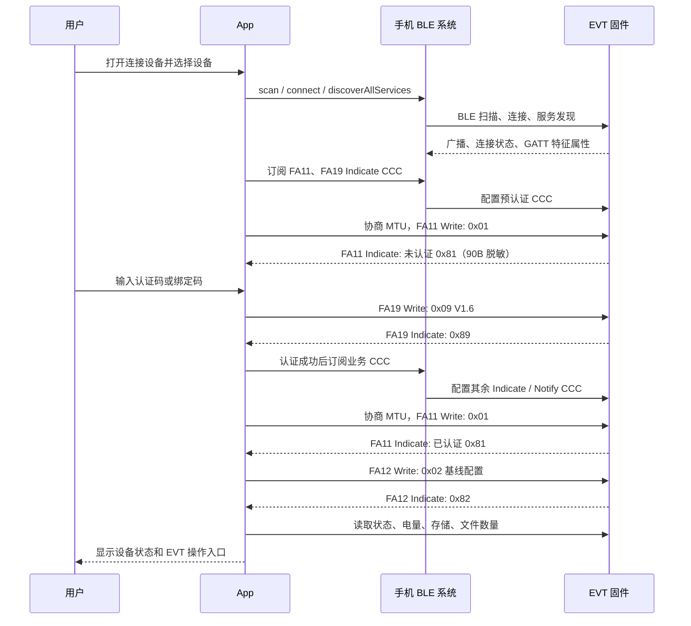

# AIPIN App 与设备 EVT 流程

## 1. 文档边界

本文只说明当前 App 与 V1.6 EVT 固件的设备联调功能、用户入口和实际数据流。它不描述本机录音、AI 转写/总结、云端服务、实时音频、文件归档、OTA/WQOTA、V2 认证或 Factory/UART 功能；这些都不是当前 `evt` 构建会发给设备的接口。

完整的命令、字段、GATT 属性、MTU 和联调验收顺序见 [真实固件 V1.6 联调说明](real-firmware-integration.md)。

## 2. App 中可用的 EVT 功能

| 用户入口 | App 做什么 | 固件需要配合什么 |
| --- | --- | --- |
| 查找设备 | 扫描附近 BLE 广播，当前实时显示名称非空的设备；手动连接后再校验 EVT GATT 合约 | 完整 V1.6 广播（字段沿用 V1.5）用于固件联调验收和稳定设备识别；自动回连按本地已记忆设备身份放宽匹配 |
| 连接设备 | 建立 BLE 连接、发现服务，先订阅 `FA11/FA19`，认证后再订阅业务特征 | 必须提供 9 个必需 EVT 特征及规定属性；`FF11` 是可选兼容特征 |
| 认证设备 | 输入当前 6 字节认证码 | `FA19` 接收 `0x09` V1 并 Indicate `0x89` |
| 首次绑定设备 | 输入希望写入的 6 字节认证码 | `0x09 Action=1` 仅在固件允许首次绑定时成功 |
| 查看和刷新状态 | 显示电量、存储、隐私、录音授权、同步状态；存在 `FF11` 时显示文件数量 | `0x01`、`0x05`、`0x06`、`0x11` 及相应 Read 特征；可选 `0x21` |
| 修改设备设置 | 切换“允许设备录音”，选择默认隐私时长 | `0x06` 的 `0x02`、`0x04` 子命令 |
| 控制设备录音 | 开始、暂停、继续、结束录音 | `0x07 -> 0x87` 返回实际录音状态 |
| 导入设备录音 | 分页查看文件，下载 `.m4a` 或 `.ogg` 到 App 记录 | `0x22 -> 0xA2` 和连续 `0xA3` Notify |
| 恢复初始认证码 | 以当前认证码确认恢复，成功后清除本地回连记录并断开 | `0x09 Action=2`，固件执行恢复/清除语义 |
| 自动回连 | 前台扫描到本地已记录的同一设备时自动尝试连接 | 优先使用 `A3 89 + BtAddressRaw[6]` 的物理地址；缺失时回退平台连接 ID |
| 实时日志 | 在设备详情查看和导出联调日志 | 无额外固件命令 |

## 3. 从扫描到可操作设备的完整流程



### 3.1 查找设备

1. 用户进入设备连接页，App 请求当前系统所需的蓝牙权限并启动低延迟 BLE 扫描。
2. 列表只显示名称非空的广播；同一个平台 BLE `connectionId` 只保留一条，新的广播更新 RSSI 和发现时间。
3. 列表按 RSSI 从强到弱排序；连续 5 秒没有收到新广播的设备会自动移除，已经连接的设备不会重复出现在列表。
4. 当前 EVT 调试构建暂时关闭手动扫描的 V1.6 广播三要素过滤：名称非空即可展示和选择。用户手动连接后，App 仍会严格校验 EVT GATT 服务、特征 UUID 和属性；不符合 GATT 合约的设备不能进入认证或控制流程。
5. Android 蓝牙关闭时，App 可请求系统显示开启蓝牙的确认；iOS 不允许 App 直接打开蓝牙，用户需在系统设置或控制中心开启后再回到 App 扫描。

固件联调时仍应始终提供完整规范广播：名称 `AIPIN_XXXX`、8 字节厂商数据和 `AF30` 服务 UUID。当前兼容扫描不会要求手动连接或自动回连的候选同时具备这三项；手动连接后由 GATT 合约决定是否可用，自动回连只匹配本地已记录的同一设备，优先使用厂商数据中的物理地址，缺失时回退平台 `connectionId`。完整广播仍用于跨平台的稳定设备识别与固件验收。

### 3.2 建立 BLE 会话

1. 用户选择设备后，App 停止扫描，使用平台 `connectionId` 建立 BLE 连接。
2. 连接成功后，App 调用服务发现并检查每个发现到的特征的 Read、Write、Notify、Indicate 属性。
3. App 将 V1.6 EVT 的九个必需特征视为认证合同：`FA11`、`FA12`、`FA15`、`FA16`、`FA17`、`FA19`、`FB11`、`FF12`、`FF13` 必须全部存在，且读、写、Indicate/Notify 属性与第 9 节一致。缺失或属性不符时，App 立即结束会话，不会进入认证页。`FF11` 是可选的兼容性文件数特征，缺失只会不显示文件数摘要。
4. 预认证只按 `FA11`、`FA19` 顺序订阅两个 Indicate CCC。读取未认证身份并完成 `Action=0` 后，再按 `FA12`、`FA15`、`FA16`、`FA17`、`FB11`、`FF12`、`FF13` 顺序订阅业务 CCC；设备提供 `FF11` 时最后建立可选订阅。任一必需订阅失败或中途关闭都会中断会话；`FF11` 的缺失或可选订阅失败不会影响认证、文件列表或导入。
5. 预认证 `0x01` 成功且 CCC 已就绪后，页面显示“设备认证（EVT）”。此时 App 不读取受保护状态，也不会发送其他业务命令。

## 4. 认证、绑定和恢复初始认证码

App 的三个按钮都使用同一个 V1 `0x09 -> 0x89` 通道：

| App 按钮 | `Action` | 输入 | 成功后 App 行为 |
| --- | --- | --- | --- |
| 认证设备 | `0` | 设备当前 6 字节认证码 | 进入认证后的同步流程 |
| 首次绑定设备 | `1` | 要写入设备的 6 字节认证码 | 进入认证后的同步流程 |
| 恢复初始认证码 | `2` | 设备当前 6 字节认证码 | 清除本地回连/下载断点，主动断开 |

具体流程：

1. 当前 EVT 调试页面输入 12 位十六进制字符，App 将每两位解码为一个原始字节（共 6 字节）；不转换成 Ticket、密码哈希或 V2 载荷。V1.6 规定的 HTTPS 取码服务尚未接入此页面。
2. App 向 `FA19` 写入 `0x09`，等待同一特征的 `0x89` Indicate。
3. 成功响应必须只有 1 字节，`1` 表示成功，`0` 表示固件拒绝认证码。其他长度或值均视为协议错误。
4. 首次绑定收到 `Action=1` 成功后，App 在同一连接立即追加 `Action=0`；只有追加认证成功才开放状态、配置和文件权限 60 秒。断连、失败或 60 秒到期后，相关按钮会重新锁定，需要再做一次认证。
5. “首次绑定”仅适用于设备仍接受初始认证码的情况；已经绑定的设备应使用“认证设备”。
6. “恢复初始认证码”是破坏性操作。App 已给出二次确认，固件必须在成功响应前完成其定义的认证码/设备内容恢复。成功后 App 不保留旧设备的自动回连关系。

认证成功后，App 先完成业务 CCC，再协商最高 `ATT_MTU=517`、读取认证态 `0x01` 设备信息并记录 `ProtocolVersion`（当前联调暂不拦截版本值），然后 `0x02` 写入当前 UTC 和基础录音参数，同时明确关闭 `AudioStream`。任一步失败都不会把页面切到“可操作”状态。

## 5. 状态与配置如何使用

认证后的设备详情页显示以下实时或最近读取的数据：

- 设备编号、固件版本、设备录音状态；
- 电量和充电状态；
- 总存储和剩余存储；
- 设备文件数量（仅设备提供 `FF11` 时）；
- 隐私状态、隐私剩余时间和同步状态；
- “允许设备录音”开关和默认隐私时长。

用户点击刷新时，App 读取 `0x06 / GET_STATUS`、`FB11` 电池和 `FA15` 存储。认证后的首次同步还读取设备 UTC、默认隐私时长；设备提供 `FF11` 时再读取文件数量。

用户切换“允许设备录音”时，App 发送 `0x06 / SubCmd 0x02`。用户选择“默认隐私时长”时，App 发送 `0x06 / SubCmd 0x04`。两个写入成功后都会刷新相关信息；固件返回错误、响应长度不符合协议或超时时，App 保留原显示值并提示本次操作失败。

设备主动变化时可在 `FA16 Indicate` 发送 `0x86 / SubCmd 0x80`。App 只在帧头、长度、CRC、CMD 和子命令都正确时才更新状态。

## 6. 设备录音控制如何使用

1. 设备处于待机时，用户点击“开始录音”，App 发送 `0x07 Action=1`。
2. 固件以 `0x87 RecordStatus=1` 回复后，App 显示“正在录音”和“暂停录音/结束录音”。
3. 用户暂停时，App 发送 `Action=2`；固件回复 `RecordStatus=2` 后，页面显示“继续录音”。
4. 用户继续时，App 发送 `Action=3`；固件回复 `RecordStatus=1` 后，页面回到录音中（V1.6 没有状态值 3）。
5. 用户结束时，App 发送 `Action=0`；固件回复 `RecordStatus=0` 后，页面回到待机。

App 以 `0x87` 的实际回包作为状态来源，不会在 Write 成功时提前假设设备已开始或停止。`0x07` 不自动重发，因为重复发送同一录音动作可能改变真实设备状态；发生超时时要根据 App 日志和固件日志确认设备最终状态。

## 7. 设备录音文件导入如何使用

1. 用户点击“设备录音文件”。App 使用 `0x22` 分页读取文件，每页最多 20 条，直至返回空页。
2. 页面只允许导入 `.m4a` 或 `.ogg`，展示文件名和 `0x22` 返回的长度。
3. 用户点击“导入到记录”后，App 向 `FF13` 写一次 `0x23` 文件请求。首次请求只带 `FileName[17]`；如果上次中断，则追加 `StartOffset` 和 `ChunkSize=0` 请求断点继续。
4. 固件从 `FF13 Notify` 连续回传 `0xA3` 数据帧。每一帧携带本帧 `FileOffset` 和 `DataLength`；App 只接受连续 offset，持续写入私有临时文件。
5. 固件用 `DataLength=0` 表示本次文件传输结束。App 确认累计长度等于文件列表中的 `FileLength` 后，将文件变成 App 记录中的一条本地录音。
6. 正常中断会保留本地断点以便下次继续；乱序、长度错误、重复结束帧或最终长度不匹配会判为失败。

当前 App 不发送 `0x26`、不请求文件元数据、不做归档确认，也不要求设备删除文件。因此固件在文件导入完成后仍应继续保留原始文件。

## 8. 回连、断开与后台行为

在一次会话已经认证成功并进入可操作状态后，App 会在本地保存最近成功设备的名称、平台连接标识和厂商数据中解析出的物理 MAC。

- 意外断连：App 在前台启动扫描，优先用物理 MAC 判断是否为同一设备。匹配后会尝试连接，最多 3 次，第二次前等待 1 秒，第三次前等待 2 秒。
- 手动断开：用户确认“断开设备”后，App 取消自动回连直到用户再次主动连接。
- 回到前台：App 会恢复最近设备的扫描和回连逻辑。
- 进入后台：App 停止扫描和自动回连，不承诺保持 BLE 长连接。回到前台后仍必须重新做服务发现、认证和同步。
- 恢复初始认证码成功：App 删除该设备的回连记录，不会再自动匹配旧关系。

Android 的 `connectionId` 往往是 MAC；iOS 是 CoreBluetooth UUID，可能随系统环境变化。因此固件的 `A3 89 + BtAddressRaw[6]` 是跨平台回连的关键身份，而不是可选调试字段。

## 9. App 实际发送和接收的协议包

业务帧统一为：

```text
[0xED][Length Low][Length High][CMD][Content ...][CRC Low][CRC High]
```

`Length` 和所有多字节业务字段按文档中的小端序解释；CRC 使用 CRC-16/CCITT-FALSE，覆盖 `CMD + Content`。App 的命令客户端会串行发送命令，避免多个请求同时等待相同响应。

| 场景 | App 写入或读取 | 固件回应 |
| --- | --- | --- |
| 认证/绑定/恢复 | `FA19 Write: 0x09` | `FA19 Indicate: 0x89` |
| 设备信息 | `FA11 Write: 0x01` | `FA11 Indicate: 0x81` |
| 基线配置 | `FA12 Write: 0x02` | `FA12 Indicate: 0x82` |
| 设备 UTC | `FA12 GATT Read` | `0x82` |
| 存储 | `FA15 Write: 0x05` | `FA15 Indicate: 0x85` |
| 状态和设置 | `FA16 Write: 0x06` | `FA16 Indicate: 0x86` |
| 录音控制 | `FA17 Write: 0x07` | `FA17 Indicate: 0x87` |
| 电池 | `FB11 GATT Read` | `0x91` |
| 文件数量（可选） | `FF11 Write: 0x21` | `FF11 Indicate: 0xA1` |
| 文件列表 | `FF12 Write: 0x22` | `FF12 Indicate: 0xA2` |
| 文件传输 | `FF13 Write: 0x23` | `FF13 Notify: 连续 0xA3` |

大多数单次命令的等待时间为 2 秒，超时最多重试一次。录音控制和安全码操作不会重试；文件传输以 15 秒没有下一数据帧作为空闲超时。响应若来自错误特征、CMD 不匹配、子命令不匹配、长度不符或 CRC 不正确，App 不会把它当作成功。

## 10. 联调日志

Debug 包会把完整 EVT 联调日志写入应用支持目录：`logs/aipin-YYYY-MM-DD.log`。单文件最大 20 MiB，保留最近 8 个文件（最多 160 MiB）。BLE 文件导入中的大量 `0x23` 数据包会最多每 200 ms 批量落盘，避免日志 I/O 干扰传输；公共下载目录镜像最多每 10 秒同步一次，导出、关闭和退出会强制写完并同步已接收日志。设备详情页右上角“实时日志”会显示当前文件路径并支持导出；Android Debug 还会尝试镜像一份到系统可访问位置，页面会显示镜像结果。

排查连接或认证问题时，App 和固件应按同一时间线核对以下事件：

```text
scan_result
-> connect_request / connection_update
-> service_discovery_success
-> notification_subscribed
-> session_authentication_ready
-> write_start / write_success
-> notification_received
-> att_mtu_ready
-> authentication_synchronization_started
-> session_interrupted 或 transport_closed
```

结构化字段会脱敏设备 ID；但当前 EVT Debug 包会在 `raw_packet_hex` 中记录完整发送和接收帧，因此可能包含认证码、文件名和音频字节，仅用于受控联调。联调时可将 App 日志中的特征、CMD、原始帧、帧长度和错误时间与固件侧 BLE/GATT 日志逐项对照；Release/Profile 构建不会持久化该日志。

## 11. 明确不应出现在 EVT 联调中的内容

- “认证服务未配置”、Ticket、ProofKey、Nonce、V2 安全包或云端认证请求；
- `FA18`、`FF16`、`0x08`、`0x26`、文件归档确认或设备文件可回收标记；
- `7033` WQOTA 服务、OTA 页面、固件包下载或 OTA 命令；
- 任何 Factory/UART/产测、未在本文命令表中的业务 CMD；
- 把 iOS `connectionId` 当作真实 MAC，或只依赖 Android MAC 做跨平台回连。
