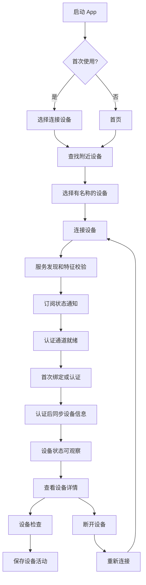
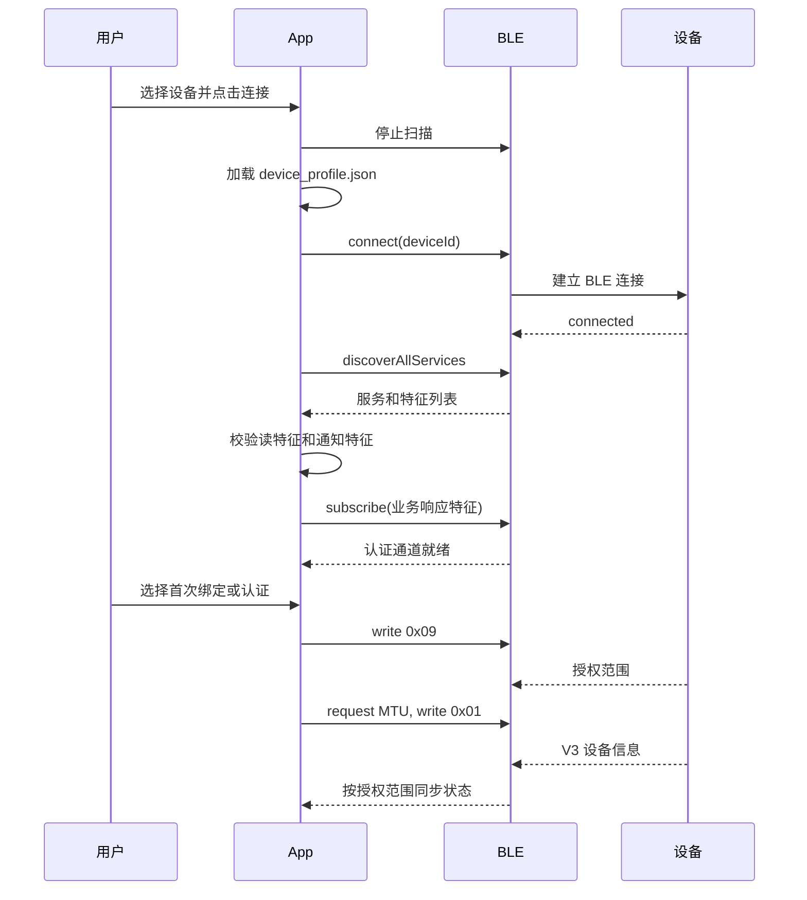
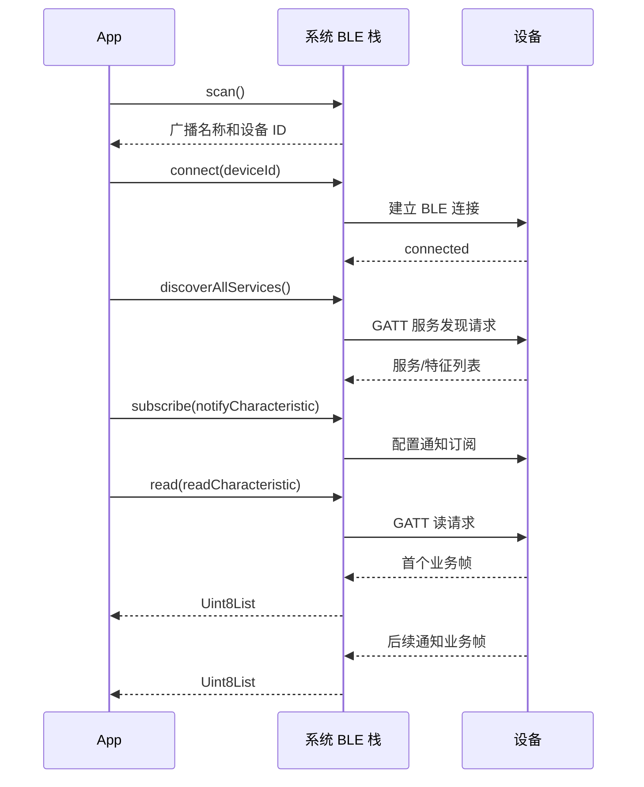

# AIPIN 声存 App 与设备流程

## 1. 文档范围

本文档只说明当前版本 App 与 AIPIN 智能录音设备之间已经实现的功能和每个功能的完整流程。

当前 App 包名为 `com.aigutta.aipin`。设备链路使用 BLE；本机录音、AI 转写和 AI 总结不属于设备链路，本文不展开。

## 2. 功能清单

面向嵌入式、移动端和测试联调的编号清单、触发入口、前置条件与异常原则见 [App-硬件联调功能清单](app-hardware-function-list.md)。本节保留产品层面的简表和后续详细流程。

| 功能 | 当前状态 | 结果 |
| --- | --- | --- |
| 首次进入选择设备 | 已实现 | 用户可从连接设备或本机录音开始 |
| 查找附近设备 | 已实现 | 持续扫描并实时更新有名称的设备 |
| 扫描去重和过期清理 | 已实现 | 相同设备不重复，5 秒无新广播会移除 |
| 已连接设备排除 | 已实现 | 当前有效连接设备不会再次出现在扫描列表 |
| 蓝牙权限检查 | 已实现 | Android/iOS 使用各自的系统权限 |
| 蓝牙关闭提示 | 已实现 | Android 可请求开启，iOS 引导用户到系统设置 |
| 连接设备 | 已实现 | 连接、服务发现、特征校验、通知订阅、绑定或认证、认证后 MTU 准入和同步 |
| 设备状态展示 | 已实现 | 连接状态、设备录音状态、电量、最近更新时间 |
| 实时状态更新 | 已实现 | 接收设备通知并更新状态和事件 |
| 协议命令通道 | 已实现 | 业务帧写入、响应匹配、超时重试和未匹配事件隔离 |
| 设备信息/业务状态读取 | 已实现 | 连接可观察后读取设备信息和 0x06 状态并展示基础信息 |
| 文件协议能力 | 已实现（导入链路） | 文件列表、元数据、分块读取、断点续传和 CRC 校验 |
| 断开设备 | 已实现 | 二次确认后取消订阅并断开 BLE |
| 重新连接 | 已实现 | 使用当前候选设备重新执行完整连接流程 |
| 设备检查 | 已实现 | 选择验证场景并输出通过、失败或不可验证 |
| 设备活动记录 | 已实现 | 保存设备检查结果和来源事件到本地数据库 |
| 硬件录音控制 | 已实现 | 设备详情页支持开始、暂停/恢复、结束，并等待 0x87 实际状态 |
| 设备音频下载/播放 | 已实现下载导入 | 设备详情页可分页读取文件、分块下载、断线后继续、校验 CRC 后导入本机记录；导入后沿用本机记录播放器 |
| 设备绑定、认证、同步、OTA | 已实现（依赖 HTTPS 服务） | 绑定/认证获授权后同步配置和状态；OTA 需要固件包服务和真实抓包向量 |

## 3. 整体流程



## 4. 启动和进入设备流程

### 4.1 启动

1. App 显示 AIPIN 启动页。
2. 从本地读取首次使用状态。
3. 首次使用显示两个入口：`连接我的设备`、`先用本机录音`。
4. 已完成首次使用直接进入首页，底部有 `首页`、`录音`、`记录` 三个导航项。

### 4.2 首次选择“连接我的设备”

1. 用户点击“连接我的设备”。
2. App 保存首次使用完成状态并进入首页。
3. App 自动启动 BLE 扫描。
4. 首页设备卡片显示“正在查找设备”，点击后进入扫描页面。

### 4.3 首次选择“先用本机录音”

1. 用户点击“先用本机录音”。
2. App 保存首次使用完成状态并进入录音页。
3. 本机录音不依赖 BLE 连接。
4. 用户之后仍可从首页设备卡片进入设备连接流程。

## 5. 查找附近设备

### 5.1 扫描流程

1. 用户打开连接设备页面。
2. App 清空上一次候选列表、选中项和错误状态。
3. App 请求 BLE 权限。
4. App 读取系统蓝牙状态。
5. 蓝牙关闭时停止扫描并显示蓝牙开启提示。
6. 蓝牙可用时启动原生低延迟 BLE 扫描。
7. 原生每收到一条广播，立即转换为候选设备并通知 UI。
8. 用户点击设备行进行选择。
9. 选中设备后，“连接设备”按钮可用。

### 5.2 列表规则

- 没有名称或名称全为空白的设备不展示。
- 相同 BLE 设备 ID 只保留一条记录；后续广播会更新 RSSI 和时间。
- 列表按 RSSI 从强到弱排序。
- 每秒检查一次候选的新鲜度，设备超过 5 秒没有新广播会从列表移除。
- 停止查找、退出页面或页面销毁时取消扫描订阅和定时器。
- 当前为便于真机联调排查，App 展示所有名称非空的 BLE 设备，不强制要求 V1.5 名称、厂商数据或服务 UUID 完整匹配。严格 V1.5 广播校验逻辑仍保留在代码中，恢复开关后才会生效。
- 当前有效 BLE 连接中的设备会从候选和选中项移除；断开后允许再次发现。

## 6. 蓝牙权限和蓝牙关闭

### 6.1 Android

1. 扫描前请求 `BLUETOOTH_SCAN` 和 `BLUETOOTH_CONNECT`。
2. Android 11 及以下保留最高 API 30 的定位权限声明。
3. 蓝牙关闭时弹出“蓝牙未开启？”。
4. 用户确认后调用 Android `BluetoothAdapter.ACTION_REQUEST_ENABLE`。
5. 系统返回开启成功后自动重新扫描；取消则停留在错误状态。

### 6.2 iOS

1. 扫描前请求 `Permission.bluetooth`。
2. 蓝牙关闭时显示“请开启蓝牙”。
3. iOS 不允许 App 直接打开蓝牙开关，用户确认后打开系统设置。
4. 用户返回 App 后，生命周期恢复回调会再次启动扫描。

### 6.3 权限失败

权限拒绝、永久拒绝或系统扫描异常会显示错误说明和“重新查找”。设置页可查看“附近设备”权限并前往系统设置。

## 7. 连接设备

### 7.1 完整连接流程



具体步骤：

1. App 停止扫描并加载设备 Profile。
2. Profile 未配置完整时，流程停止并显示“GATT 配置未完成”。
3. 连接设备，超时时间为 12 秒。
4. 连接成功后发现全部 GATT 服务。
5. 校验 Profile 中的读服务/读特征和通知服务/通知特征是否存在。
6. 端点校验要求 `FB11 Read`、`FA16 Indicate`、`FA11 Write + Indicate` 和 `FA19 Write + Indicate`；通过后按实际发现结果订阅业务响应特征。
7. 订阅建立后会话进入 `authenticationReady`，不会读取 FB11 或发送其他受保护命令。
8. 用户选择首次绑定或认证后，App 先按本次 `0x09` 的帧长度校验 ATT MTU，再请求 ticket 并发送握手；受保护 GATT 返回认证或加密不足时，App 提示用户在系统弹窗完成设备配对后重试。
9. `0x09` 成功后，App 请求 `ATT_MTU=517`；系统实际协商值小于 `136` 时中断连接，并提示“设备蓝牙 MTU 不足，无法读取设备信息”。
10. MTU 准入通过后，App 通过 `0x01` 验证 `ProtocolVersion=3`；成功后会话进入 `observable`，只同步 `GrantedScope` 允许的 `0x06`、`0x11`、`0x05`、`0x21` 和文件信息。

### 7.2 会话状态

```text
等待连接
  -> 已选择设备
  -> 正在连接
  -> 服务已发现
  -> 正在订阅状态
  -> 认证通道就绪
  -> 首次绑定或认证
  -> 认证后同步设备信息
  -> 状态可观察
```

连接、服务发现、订阅、认证或认证后同步异常时进入“会话已中断”。成功连接的设备会从扫描列表排除。

## 8. 设备 Profile 和 GATT 端点

设备配置来源为 `assets/config/device_profile.json`，当前关键值如下：

| 项目 | 当前值 |
| --- | --- |
| 广播名称前缀 | `AIPIN` |
| 厂商数据前缀 | `A389` |
| 广播服务 UUID | `0000AF30-0000-1000-8000-00805F9B34FB` |
| GATT 服务 UUID | `0000FA10-1212-EFDE-1523-785FEABCD123` |
| 读服务 UUID | `0000FB10-1212-EFDE-1523-785FEABCD123` |
| 读特征 UUID | `0000FB11-1212-EFDE-1523-785FEABCD123` |
| 通知服务 UUID | `0000FA10-1212-EFDE-1523-785FEABCD123` |
| 通知特征 UUID | `0000FA16-1212-EFDE-1523-785FEABCD123` |

Profile 中声明了每个逻辑端点的 UUID 和操作能力。连接后按实际发现结果订阅所有已配置的 Notify/Indicate；命令层根据端点能力选择 Write 或 Write Without Response。FA/FB/FF 业务服务使用协议规定的 `0000xxxx-1212-EFDE-1523-785FEABCD123`，WQOTA 使用标准 16-bit UUID 展开形式。

## 9. 设备状态和实时通知

### 9.1 设备详情展示

连接进入 `observable` 后，设备详情显示：

- 设备名称；
- 连接状态；
- 设备录音状态：正在录音、未在录音或暂时无法获取；
- 电量（设备返回时）；
- 最近更新时间；
- 发生异常时的错误说明和最后有效状态。

页面右上角提供“实时日志”入口；连接帮助入口已移除，避免把静态提示误认为诊断能力。

### 9.2 设备信息获取与 App 发起步骤

当前 App 与设备之间的通信分为 BLE 标准操作和业务数据接收两部分。App 实际发起的步骤如下：

| 顺序 | App 发起的操作 | 设备/系统返回 | 当前用途 |
| --- | --- | --- | --- |
| 1 | 启动 BLE 扫描 | 系统回调广播包 | 获取设备 ID、名称、RSSI、厂商数据和广播服务 UUID |
| 2 | `connect(deviceId)` | BLE 连接状态 | 建立当前会话 |
| 3 | `discoverAllServices` | GATT 服务和特征列表 | 校验设备是否具备读和通知端点 |
| 4 | `subscribe(notifyCharacteristic)` | 通知数据流 | 持续接收设备状态和事件 |
| 5 | `read(readCharacteristic)` | 读特征返回字节 | 获取连接后的第一份状态帧 |
| 6 | 不主动发送业务命令 | 设备通过首读或通知返回业务帧 | App 解码并更新状态 |

对应的通信时序为：



需要特别区分：

- 扫描、连接、服务发现、订阅和读取是 App 发起的 BLE 操作；
- `subscribe` 由系统 BLE 栈配置通知开关，App 同时把通知字节交给协议命令客户端；
- 写特征使用 `BleTransport.write`，业务帧由 `EvtProtocolCodec` 构造，`EvtCommandClient` 负责串行化、响应匹配、超时和重试；
- MTU 准入后，App 主动请求 `0x01` 设备信息；`0x06` 业务状态、存储和文件信息仅在认证授予相应 scope 后读取，并在设备详情展示。

### 9.3 App 发往设备的数据包和操作

当前版本 App 发往设备的内容分为 BLE 标准操作和自定义业务数据两类：

| App 操作 | 是否发送自定义数据包 | 设备侧动作/返回 |
| --- | --- | --- |
| BLE 扫描 | 否 | 设备广播，App 接收广播信息 |
| 建立连接 | 否 | BLE 建立链路并返回连接状态 |
| 服务发现 | 否 | 设备返回 GATT 服务和特征列表 |
| 订阅通知 | 否（系统可能内部配置 CCCD） | 设备开始向通知特征推送数据 |
| 读取读特征 | 否（GATT 标准读请求） | 设备返回首个业务帧字节流 |
| 写入业务命令 | 已实现 | `EvtCommandClient` 串行写入业务帧，按 CMD/子命令匹配响应，2 秒超时并最多重试一次 |

App 当前可通过会话控制器调用设备信息、状态、录音控制、文件列表、文件元数据、文件分块和归档确认。所有调用都会先编码业务帧，再由命令客户端写入对应特征并等待响应；未配置或未连接时直接返回可诊断错误。

### 9.4 业务数据包格式参考

设备返回和 App 发出的业务帧均由 `EvtProtocolCodec` 校验/构造，格式如下：

```text
[0xED][Length Low][Length High][CMD][Content ...][CRC Low][CRC High]
```

- `0xED`：固定同步字；
- `Length`：小端序，数值为 `3 + Content.length`，包括 `CMD` 和 2 字节 CRC；
- `CMD`：业务命令字节；
- `Content`：命令内容，可为空；
- `CRC`：对 `CMD + Content` 计算 CRC-16/CCITT-FALSE，小端序排列。

无内容的 `CMD=0x01` 帧示例：

```text
ED 03 00 01 D1 F1
```

其中 `03 00` 表示长度为 3，`D1 F1` 是对 `01` 计算得到的 CRC。设备返回后，App 按以下步骤处理：

1. 检查同步字、长度和实际字节数。
2. 计算 CRC 并与数据包中的 CRC 比较。
3. 校验成功后按 `CMD` 映射为设备事件。
4. 命令为 `0x87` 或 `0x91` 且内容满足要求时，更新录音状态或电量快照。
5. 未知命令仍保留为 `unknown` 事件；设备检查遇到未知事件时判为不可验证。

### 9.5 首读和通知流程

1. 首读用于建立第一份有效状态快照。
2. 通知特征收到数据后，App 解码为设备事件。
3. 可识别的状态事件会更新最新快照。
4. 未知事件、帧长度错误、同步字错误或 CRC 错误不会被当作成功状态。
5. 通知异常会使会话中断，但保留最后一份有效快照供页面显示。

当前已识别的设备信息包括：设备信息、存储变化、状态变化、录音开始、静音结束、音频接收、鉴权、电池、文件数量、文件列表和文件数据事件。协议服务层可主动请求设备信息、业务状态、录音控制、文件列表、元数据、分块数据和归档确认；设备文件经过完整性校验后会导入本机记录并可从记录详情播放。

### 9.6 设备文件导入流程

1. 用户在设备详情点击“设备录音文件”，App 使用 `0x22` 从 offset=0 开始分页读取，直到设备返回 Count=0。
2. 用户点击某条文件的“导入到记录”，App 先用 `0x26/0x01` 获取完整元数据（长度、时长、CRC-32 和 17 字节文件名槽）。
3. App 为设备 ID 与 17 字节文件名槽创建本地 checkpoint；checkpoint 只保存期望长度、CRC-32、已接收 offset 和临时文件 ID，音频内容只写入应用私有目录的 `.part` 文件。
4. App 以 `0x23` 请求文件数据：首次从 checkpoint offset 开始，后续请求携带上一个连续 offset；每个响应都校验响应 offset 和 DataLength。连接中断后，再次点击同一文件会从临时文件已接收长度继续。
5. 下载过程中页面显示已接收字节数和进度。缺口、空包、超长或 CRC/长度不匹配属于完整性错误：会删除临时/已导入文件与 checkpoint，不写入本机记录；普通传输中断则保留进度等待下次继续。
6. 接收完成后校验本地文件大小和 CRC-32 必须同时匹配元数据。校验成功后以设备文件名创建一条本机录音记录，并清除 checkpoint；文件保留 `.ogg` 或 `.m4a` 原始扩展名，记录页可打开详情并使用既有播放器播放。
7. 当前版本不会在没有云端持久化成功回执时发送 `0x26/0x02` 归档确认，因此设备文件仍由设备保留，不会被 App 误标记为可回收。

### 9.7 实时音频接收

1. 只有 `0x09` 认证返回的 `GrantedScope` 包含实时音频权限时，设备详情才显示“实时音频”。
2. 用户点击“开始接收”后，App 单独订阅 `FA18`；业务 `0xED` 通知和实时数据不共用解析器。
3. App 写入完整 `0x02` 配置，将 `AudioStream=1`，再发送 `0x07` 开始录音。只有格式正确的 `0x08` payload 会按收到顺序写入内存中的有界原始捕获。
4. 用户停止时，App 先将 `AudioStream=0`，再发送 `0x07` 停止录音并取消 `FA18` 订阅。
5. 接收数据超过 64 MiB 时，App 自动执行停止流程并报告可恢复错误，不继续占用内存。
6. V1.5 没有在 `0x08` 中声明可播放的编解码信息，因此页面只允许导出 `.bin` 原始数据，不会把未知数据标记为可播放录音。

### 9.8 固件升级（WQOTA）

1. 只有认证授予 `OTA` 权限时，设备详情才显示“固件升级”。
2. App 先向 HTTPS 固件包服务请求当前设备的固件清单和受控下载包。清单必须包含 VID、PID、WQOTA 镜像版本、升级后的业务软件版本、payload 长度与 CRC-32、以及目标固件抓包冻结的请求/响应各 4 字节前缀和标志。
3. 服务未配置、包字段缺失、目标设备不匹配或 CRC-32 不正确时，升级页显示阻断原因，绝不开始传输。当前工程默认固件服务未配置，因此真机不会伪装为可以升级。
4. 包校验通过后，App 使用包内请求前缀写入 `7033/2001`，使用包内响应前缀订阅并解析 `7033/2002`。WQOTA 通道与业务 `0xED` 通道完全分离。
5. App 按 `0x02 -> E1 -> E2 -> E3 -> E5 -> E6 -> E8 -> 0x03` 执行。`E5` 按设备给出的窗口发送，坐标包含 18 字节镜像头；每个块带 CRC-32，窗口末尾的响应同时校验 opcode、SN、结果码和下一窗口。
6. 每个窗口成功后，以设备 ID 与包 SHA-256 保存本地断点；用户取消或传输失败发送 `E4`，不将升级标记为成功。
7. `E8 state=0` 只代表同步流程结束。App 仍显示“等待重连核验”，设备重启后重新执行 BLE 连接、首读与业务版本读取；只有返回的业务软件版本精确匹配固件清单声明的目标版本，才清除断点并显示“升级完成”。

## 10. 断开和重新连接

### 10.1 断开

1. 用户在设备详情点击“断开设备”。
2. App 弹出确认弹窗。
3. 用户确认后取消通知订阅。
4. App 调用 BLE `disconnect(deviceId)`。
5. 会话进入中断状态，并解除扫描排除。
6. 设备记录和 Profile 不会被删除。

### 10.2 重新连接

1. 会话不是 `observable` 时，详情页显示“重新连接”。
2. 用户点击后，App 使用当前候选设备 ID 重新执行连接、服务发现、订阅和首读。
3. 成功后回到“状态可观察”。
4. 失败后保留错误面板和重试入口。

## 11. 设备检查

设备检查是“对已有证据做规则判断”，不是一套会自动操作硬件的测试流程。App 不会在检查页自动开始或结束录音、触发恢复或读取待机功耗。用户需要先让设备产生相应的状态或通知，再进入检查页查看结果。

### 11.1 检查前提

1. 设备会话必须处于 `observable`（状态可观察）。只有此时设备详情页才显示“设备检查”。
2. 进入检查页时，App 读取当前会话的 `latestSnapshot` 和已收到的 `events`，并将它们作为本次检查的证据输入。
3. 当前实现把进入页面时的同一份 `latestSnapshot` 同时作为初始快照和最终快照；它们不是两个时间点重新采集的快照。因此“恢复前/后”和“录音前/后”只能基于当前已有数据判断，不能视为严格的前后状态测试。
4. 选择场景后，验证器先检查必需字段，再检查事件顺序和状态规则：
   - 缺少字段时返回“不可验证”，并列出缺失字段；
   - 事件中包含未知协议事件时返回“不可验证”；
   - 证据齐全后才返回“通过”或“失败”。
5. 用户可以查看判定原因；点击“保存验证结果”后，App 将本次快照、事件和判定写入本地设备活动。

### 11.2 各场景怎么检查

| 场景 | 用户操作 | App 使用的数据 | 判定条件 | 当前限制 |
| --- | --- | --- | --- | --- |
| 设备访问 | 保持设备连接，进入检查页并选择“设备访问”。 | 进入页面时的最终状态快照。 | 最终状态已知即可继续判断；状态为 `unbound` 或 `safeOff` 判定“失败”，其他已知状态判定“通过”。 | 不会在此处重新读取状态；只能判断最近一次已收到的状态。 |
| VAD 录音 | 先在设备侧完成一次录音和静音结束，再回到检查页选择“VAD 录音”。 | 状态快照、会话通知事件。 | 必须存在 `recordingStarted -> silenceEnded` 的顺序事件，且最终状态为 `standby`；缺少初始或最终状态时“不可验证”。 | App 不能从检查页启动设备录音；事件必须在进入检查页前已经通过通知收到。初始/最终快照当前相同。 |
| 电池与充电 | 让设备发送电池状态后进入检查页，选择“电池与充电”。 | 快照中的电量百分比和充电状态。 | 两个字段都存在即可“通过”；缺任一字段为“不可验证”。 | 只有合法 `0x91` 帧且内容至少包含电量和充电位时才会填充这两个字段；不会主动轮询电池。 |
| 待机功耗 | 进入检查页选择“待机功耗”。 | 快照中的 `standbyPowerMilliwatts`。 | 字段存在即可“通过”，缺失为“不可验证”。 | 当前真实 BLE 会话没有填充该字段，因此实际通常为“不可验证”；不会自动执行功耗测量。 |
| 恢复验证 | 在设备侧完成恢复动作后进入检查页，选择“恢复验证”。 | 初始和最终状态快照。 | 缺任一状态为“不可验证”；最终状态为 `safeOff` 判定“失败”，否则“通过”。 | App 不会触发恢复，也没有独立的恢复前/后采集；当前两个快照来自同一份页面输入。 |
| 物理反馈 | 选择“物理反馈”，填写人工观察备注（可附标签）并提交。 | 用户填写的人工备注。 | 备注去除空格后非空即可“通过”；为空为“不可验证”。 | 结果代表人工观察，不是设备自动检测；提交表单后才保存。 |

### 11.3 结果与保存

页面会显示三种结果：

- `通过`：必需证据齐全，且场景规则满足；
- `失败`：证据齐全，但场景规则不满足，并显示失败原因；
- `不可验证`：证据缺失或包含未知协议事件，并显示缺失字段或原因。

只有点击“保存验证结果”才会创建设备活动记录。未保存时，判定仅停留在当前检查页面，不会写入本地记录。

## 12. 设备活动记录

1. 保存设备检查时创建一条证据记录。
2. 记录包含设备 ID、设备名称、判定、原因、创建时间、当前快照、事件和诊断字段。
3. 数据写入本地 Drift 数据库 `evt_evidence`，不上传云端。
4. `记录` 页面切换到“设备活动”后，可查看“已完成设备检查”。
5. 用户可以查看记录摘要或删除记录；删除会同时删除关联来源事件。

## 13. 设备能力边界

当前 App 已提供的设备侧用户入口包括：

```text
发现设备 -> 选择设备 -> BLE 连接 -> GATT 校验
-> 订阅通知 -> 首读状态 -> 实时状态展示
-> 设备状态/录音控制/文件导入/实时音频/设备检查
```

其中受外部服务约束的流程会如实显示阻断状态：

- 设备认证、解绑清除需要安全票据服务；未配置时不会伪造认证成功。
- 设备文件在本地校验完成后，还需要归档服务返回持久化成功，App 才发送 `0x26/0x02` 确认。
- 固件升级需要 HTTPS 固件包清单、下载服务与请求/响应前缀抓包向量；未配置时升级页不可执行。

当前不属于 V1.5 用户 App 的范围：

- 工厂、UART 和产测协议；
- 设备内部 VAD、LED、双麦算法或功耗测量控制；
- 不在协议中定义的云端账号同步能力。

## 14. 关键代码入口

| 功能 | 代码位置 |
| --- | --- |
| App 入口和导航 | `lib/app/app_shell.dart` |
| BLE 抽象 | `lib/core/ble/ble_transport.dart` |
| BLE 平台实现 | `lib/core/ble/reactive_ble_transport.dart` |
| 扫描控制器 | `lib/features/device_discovery/application/discovery_controller.dart` |
| 扫描页面 | `lib/features/device_discovery/presentation/discovery_page.dart` |
| 广播过滤 | `lib/features/device_discovery/domain/advertisement_filter.dart` |
| 设备配置 | `assets/config/device_profile.json` |
| 连接状态机 | `lib/features/device_session/application/session_controller.dart` |
| 设备详情 | `lib/features/device_session/presentation/device_detail_page.dart` |
| 实时音频 | `lib/features/device_session/application/realtime_audio_controller.dart` |
| 固件升级 | `lib/features/device_session/presentation/firmware_update_page.dart` |
| WQOTA 传输 | `lib/features/device_session/application/wqota_update_controller.dart` |
| 协议解码 | `lib/core/protocol/evt_protocol_codec.dart` |
| 设备检查 | `lib/features/observation/presentation/observation_page.dart` |
| 验证规则 | `lib/features/observation/domain/observation_verifier.dart` |
| 设备活动存储 | `lib/features/evidence/data/drift_evidence_repository.dart` |
| 实时日志存储/页面 | `lib/features/device_logs/` |

## 15. Debug 日志

Debug 构建会输出带时间戳的 App 链路日志，Release 构建不会输出这些日志。日志前缀按模块区分：

- `[AIPIN][BLE]`：扫描、蓝牙状态、连接状态、服务发现、通知订阅、读写异常；
- `[AIPIN][SESSION]`：会话阶段迁移、首读结果、协议解码、断开原因和资源清理；
- `[AIPIN][AI]`：AI 服务请求和处理状态。

Debug 日志同时写入应用支持目录下的 `logs/aipin-YYYY-MM-DD.log`（Android 和 iOS 均使用各自的 Application Support 目录），单文件超过 5 MB 自动轮转，保留最近 7 个文件。设备详情右上角“实时日志”页面显示当前绝对路径，可导出该文件。

Android 真机可使用 `adb logcat -v time | findstr AIPIN` 查看；也可在 `flutter run` 的终端直接查看。iOS Debug 使用 Xcode 的控制台查看 `[AIPIN]` 前缀。

为便于分析连接问题，重点关注同一时间段内的 `connect_request`、`connection_update`、`service_discovery_success`、`notification_subscribe_start`、`read_start`、`session_interrupted` 和 `transport_closed`。日志只记录状态、时间点、服务/特征 UUID、帧长度等元数据，设备 ID 仅保留末尾 4 位，不记录音频、转写或总结正文。
