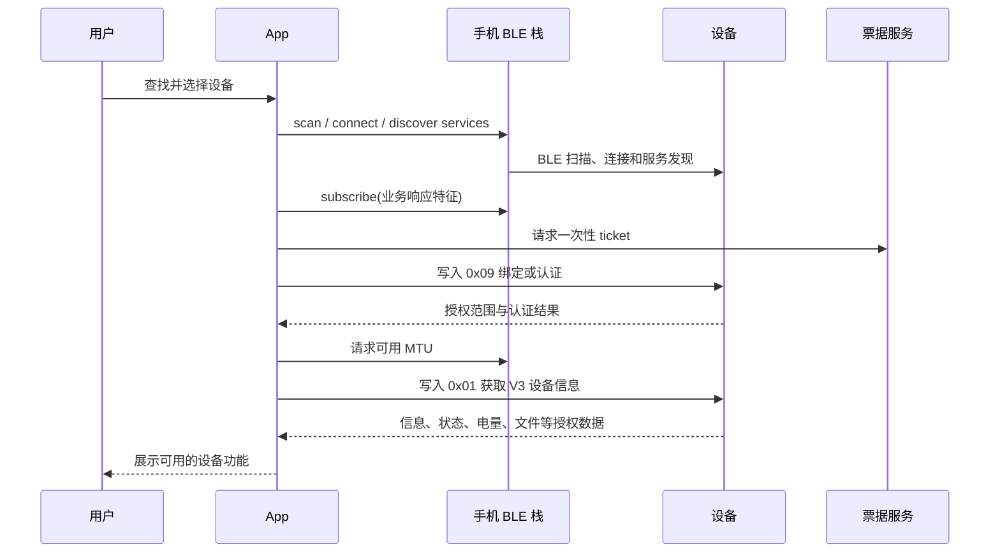

# AIPIN App-硬件联调功能清单

## 1. 范围和状态说明

本文档以当前 App 代码为准，列出移动端已经具备的硬件联调功能、触发入口、App 与固件的交互方式，以及可进入真实联调的前置条件。本文档仅覆盖 BLE 设备链路；本机录音、AI 转写和 AI 总结属于 App 独立能力，不在本清单内。

| 状态 | 含义 |
| --- | --- |
| 已实现 | App 已有页面入口、业务逻辑和协议收发实现，可使用满足条件的真实固件联调。 |
| 受条件限制 | App 已实现，但需要固件授权范围、对应 GATT 属性或 HTTPS 服务配置才会开放或完成。 |
| 不在范围 | V1.5 中存在但不属于普通用户 App 的接口，当前 App 不会调用。 |

## 2. 功能总览

| 编号 | 功能模块 | 用户或系统触发 | App 端实现 | 固件交互/依赖 | 状态 |
| --- | --- | --- | --- | --- | --- |
| H-F01 | 设备发现 | 用户进入“连接设备”或点击重新查找 | 请求系统权限、启动低延迟 BLE 扫描、按设备 ID 去重、RSSI 排序、5 秒无新广播自动移除 | BLE 广播；当前为便于真机排查，展示所有名称非空的设备，不要求 V1.5 名称、厂商数据或服务 UUID 完整匹配 | 已实现 |
| H-F02 | 连接与 GATT 准入 | 用户选择设备并点击连接 | 停止扫描、连接、发现服务、校验必需 Characteristic 属性、订阅业务通知、协商 MTU | `FB11`、`FA16`、`FA11`、`FA19`；基础连接超时 12 秒 | 已实现 |
| H-F03 | 首次绑定与再次认证 | 认证通道就绪后由用户选择 | 申请一次性 ticket、组装并发送 `0x09`，处理授权范围、配对不足和认证失败 | 设备 `0x09` 协议；HTTPS 票据服务必须签发 ticket 和 32 字节 proof key | 受条件限制 |
| H-F04 | 协议通道与状态订阅 | 连接成功后自动 | 订阅 Indicate/Notify、解析 `0xED` 帧、按 CMD 匹配响应、2 秒超时并最多重试一次、隔离未知或校验失败帧 | `FA16` 等业务响应端点；帧 CRC-16/CCITT-FALSE 校验 | 已实现 |
| H-F05 | 设备信息与基础状态 | 认证成功后自动；用户点击刷新 | 读取 V3 设备信息、业务状态、电量、存储、文件数量、配置时间和隐私时长，并更新详情页 | `0x01`、`0x05`、`0x06`、`0x11`、`0x21`；仅请求授权范围允许的字段 | 已实现 |
| H-F06 | 设备配置与隐私设置 | 设备详情中的对应设置操作 | 写入录音同意状态、隐私时长、当前 UTC 与实时音频开关等配置；缓存有效配置模板 | `0x02`；需具备 `FA12`/`FA16` 写入与响应属性，并由授权范围允许 | 受条件限制 |
| H-F07 | 设备录音控制 | 设备详情点击开始、暂停/恢复或结束录音 | 下发控制命令，等待 `0x87` 实际状态再刷新 UI，而非只按点击结果变更页面 | `0x07`；需要 `FA17 Write + Indicate` 和录音控制权限 | 受条件限制 |
| H-F08 | 设备文件浏览与导入 | 设备详情打开“设备录音文件”并导入单条文件 | 分页列出文件、读取元数据、分块下载、断点续传、长度和 CRC-32 校验；成功后导入本机记录并复用本机播放器 | `0x22`、`0x23`、`0x26/0x01`；需要 `FF12`、`FF13`、`FF16` 端点和文件权限 | 受条件限制 |
| H-F09 | 设备文件归档确认 | 导入完成且归档服务确认已持久化 | 仅在本地校验通过且服务返回 `durable: true` 后，向设备发送归档确认；否则保留设备文件 | `0x26/0x02`；HTTPS 归档服务和文件权限均为必需条件 | 受条件限制 |
| H-F10 | 实时音频接收 | 用户点击开始/停止接收 | 单独订阅 `FA18`，配置 `AudioStream` 后控制设备录音，按顺序保存有界原始数据；达到 64 MiB 自动停止，可导出 `.bin` | `0x02`、`0x07`、`0x08`；需实时音频授权和 `FA18 Notify`。V1.5 未声明音频编解码，App 不将该数据伪装成可播放录音 | 受条件限制 |
| H-F11 | 设备数据清除 | 用户在设备详情选择清除并二次确认 | 先检查待归档文件，再申请清除授权并执行确认；全过程显示进行状态和失败原因 | `0x09` 的清除流程；需要清除授权、票据服务和对应端点 | 受条件限制 |
| H-F12 | 固件升级 | 用户在设备详情打开“固件升级” | 获取并校验固件包、协商 MTU、按 WQOTA 窗口发送、保存断点、传输后重连并通过业务版本复核 | `7033/2001`、`7033/2002`；HTTPS 固件包服务、OTA 授权、真实前缀向量和支持最终校验的固件均为必需条件 | 受条件限制 |
| H-F13 | 断开与重新连接 | 用户主动断开；会话中断后点击重连 | 取消通知订阅、关闭实时音频/WQOTA 会话、断开 BLE；重连时重新执行连接、认证和同步链路 | BLE 连接状态；认证授权在断开或过期后失效 | 已实现 |
| H-F14 | 设备检查与活动记录 | 设备详情进入“设备检查”并选择场景 | 基于当前状态快照和本次会话事件判定通过、失败或不可验证；用户确认后保存本地活动记录 | 不新增控制命令；依赖此前收到的设备状态、录音和电池等事件 | 已实现 |
| H-F15 | 联调日志 | 设备详情打开“实时日志”或导出日志 | 记录扫描、连接、命令收发结果、协议校验和错误；日志脱敏后保存至本地，可用于真机定位 | 不依赖固件额外接口；二进制音频、ticket、proof key 等敏感内容不会写入日志 | 已实现 |

## 3. 核心交互流程

### 3.1 发现、连接、认证与同步

1. App 先完成 BLE 连接、服务发现和业务通知订阅；认证前不会发送受保护的设备信息、状态或文件命令。
2. 绑定或认证的 `0x09` 必须先从票据服务取得本次一次性材料。系统要求配对时，App 提示用户完成 Android/iOS 系统配对弹窗后重试。
3. 认证成功后，App 校验协商 ATT MTU；低于相应命令的最小 MTU 时不发送半帧。
4. `0x01` 返回 `ProtocolVersion=3` 后，App 才进入可观察状态，并严格按设备返回的授权范围显示后续功能。

### 3.2 设备录音与文件导入

1. 用户从设备详情执行开始、暂停/恢复或结束；App 通过 `0x07` 请求设备动作。
2. App 只在收到 `0x87` 设备状态后将录音状态更新到页面。
3. 用户打开设备文件列表后，App 用 `0x22` 分页读取；同一个 `FileName[17]` 只展示一次。
4. 导入时，App 先用 `0x26/0x01` 读取长度、时长、CRC-32 等元数据，再以 `0x23` 按 offset 连续下载。
5. 断连时保留 `.part` 临时文件和 checkpoint；再次导入同一文件时从已确认 offset 继续。
6. 只有总长度和 CRC-32 都匹配时，才写入本机记录。归档服务确认持久化后才会发送 `0x26/0x02`，避免设备文件被过早清除。

### 3.3 失败与恢复原则

| 场景 | 当前 App 行为 |
| --- | --- |
| 蓝牙关闭或权限被拒绝 | 停止扫描并提示用户开启蓝牙或前往系统设置；Android 请求系统开启蓝牙，iOS 引导系统设置。 |
| GATT 服务或属性不完整 | 不进入认证或后续业务操作，显示可诊断的配置失败原因。 |
| 命令无响应 | 命令客户端等待 2 秒后最多重试一次；仍无响应则返回失败，不把 UI 标记为成功。 |
| CRC、长度或未知帧 | 丢弃无效帧并记录诊断日志，不覆盖最后一份有效设备状态。 |
| 连接断开 | 取消通知和临时传输会话，撤销授权范围；文件下载保留可恢复 checkpoint。 |
| 归档或固件包服务未配置 | 对应入口保持不可用或显示“未配置”，不会以模拟成功继续设备操作。 |

## 4. 联调前置条件

1. 设备应实现 V1.5 用户态协议：`0x01`、`0x02`、`0x05`、`0x06`、`0x07`、`0x08`、`0x09`、`0x11`、`0x21`、`0x22`、`0x23`、`0x26`，以及需要 OTA 时的独立 WQOTA 服务。
2. 真实设备应具备目标功能所需 GATT Characteristic 与属性；App 会按实际发现结果阻止不安全的读写。
3. 绑定/认证、归档确认和 OTA 分别需要配置 HTTPS 票据服务、归档服务和固件包服务。HTTP 地址会被视为未配置，App 不会为安全材料降级传输。
4. 真机调试日志位于应用支持目录的 `logs/aipin-YYYY-MM-DD.log`；单文件最多 5 MiB，保留最近 7 个文件。

## 5. 不在普通用户 App 范围的 V1.5 接口

Factory、UART、`0x03`、`0x04`、`0x0A`、`0x0B`、`0x24`、`0x25`、`0x27`、`0x28` 和业务 `0x31` 不在当前 App 范围。它们不会因页面存在而被 App 调用。

更详细的收发帧格式、端点 UUID、字段和时序见 [App 与设备流程](app-device-flow.md) 与 [真实固件 V1.5 联调说明](real-firmware-integration.md)。
