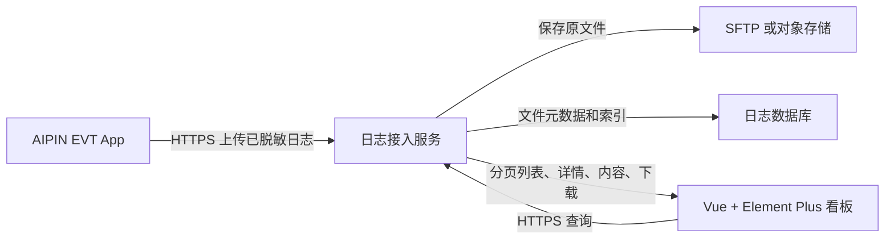

# EVT App 日志服务与看板服务端需求

## 目的

本说明用于和日志服务器、后端及看板团队对齐。目标是让 AIPIN EVT App 上传已脱敏的运行日志，服务端安全保存并建立索引，联调人员通过日志看板检索、查看和下载文件。

本说明不包含服务器地址、账号、目录、私钥或其他凭据。

## 现有资料结论

`testApp日志账号使用说明.md` 已说明一套受限 SSH/SFTP 日志账号：

- 使用 SSH 私钥认证，不使用密码认证。
- 资料中包含连接主机、端口、受限账号、默认 SFTP 目录和服务器实际目录。
- 已确认该账号可登录、上传、下载和列目录，且没有 Shell、sudo 或其他目录权限。
- 私钥仅以本机文件位置被引用，没有可安全用于构建的私钥内容。
- 未提供 SSH 主机 SHA-256 指纹。
- 账号名称属于 `testApp`，不能默认视为已授权给 AIPIN/EVT App。

因此，资料足以作为 SFTP 环境的基础参考，但不足以完成 AIPIN/EVT App 的真实安全上传，也不能直接支持浏览器日志看板。

## 推荐架构



生产环境建议由日志接入服务持有 SFTP 私钥，App 只通过 HTTPS 上传。这样私钥不会进入 APK，日志看板也不会接触 SFTP 账号。

当前 App 已实现受控 Debug 包直连 SFTP 的能力，可用于服务器 API 尚未完成前的短期联调。该模式只适用于临时、可撤销的专用账号和私钥，不能作为可分发版本的长期方案。

## 当前 App 对服务器的要求

### 1. SFTP 联调能力

若先使用当前 App 的直连 SFTP 上传，服务器需提供：

| 项目 | 服务端需要提供或确认的内容 |
| --- | --- |
| 专用账号 | 为 AIPIN/EVT 单独创建受限账号，或书面确认现有账号可用于该 App；不能默认复用 `testApp` 账号。 |
| 私钥授权 | 为该账号授权 Ed25519、RSA 或 EC 公钥。私钥应通过受控渠道交付给内部构建人员，不进入代码仓库或聊天记录。 |
| 主机身份 | 提供 OpenSSH `SHA256:...` 主机指纹。App 会固定校验该指纹，不能采用首次连接自动信任。 |
| 上传目录 | 提供绝对目录和默认登录目录，并保证账号被限制在指定日志目录。 |
| 网络可达性 | 明确域名或 IP、SSH/SFTP 端口、手机网络是否需要 IP 白名单、VPN 或内网访问。 |
| 容量与限流 | 确认单文件至少支持 20 MiB、目录配额、并发上传数量、连接和传输超时限制。 |
| 保留策略 | 明确保留天数、超期清理责任、磁盘告警阈值及备份要求。 |

### 2. 文件操作权限与账号边界

当前 App 的上传顺序为：生成私有脱敏快照，上传为同目录隐藏 `.part` 文件，成功后原子重命名为 `.log`，失败时删除临时文件。嵌入受控 Debug APK 的 App 上传账号必须与服务端读取账号分离；App 不列目录、不下载文件，也不为看板提供读取能力。

| 操作 | App 上传账号 | 日志接入服务或看板后端账号 | 说明 |
| --- | --- | --- | --- |
| 列目录 | 不需要 | 需要 | 仅服务端用于入库、看板检索和排查。 |
| 创建文件 | 需要 | 按存储实现需要 | App 写入新的 `.part` 临时文件。 |
| 写入文件 | 需要 | 按存储实现需要 | App 上传日志内容。 |
| 创建隐藏文件 | 需要 | 按存储实现需要 | App 临时文件名以 `.` 开头。 |
| 同目录重命名 | 需要 | 按存储实现需要 | App 将 `.part` 原子改名为最终 `.log`。 |
| 删除临时文件 | 需要 | 需要 | App 失败后清理半文件；服务端可清理陈旧半文件。 |
| 下载只读 | 不需要 | 需要 | 看板后端读取和下载脱敏日志；浏览器本身不应拥有 SFTP 权限。 |
| 覆盖最终文件 | 不允许 | 不允许 | 最终 `.log` 应拒绝覆盖；临时文件冲突返回可重试错误。 |

### 3. App 上传文件约束

服务端接收器需要按下列规则校验并记录文件：

- 仅接收 UTF-8 文本日志。App 本地快照和上传请求中的最终文件名均为 `aipin-YYYY-MM-DD-HH-MM-SS[-序号].log`，接收器应按该时间格式校验。
- 服务端将该文件名保存为 `source_filename`，内部存储路径必须使用不透明且唯一的 `storage_key`，不能以 `source_filename` 作为覆盖依据；这样可以支持多台手机在同一秒上传同名时间文件。
- 单文件上限为 20 MiB；超出时应拒绝并返回稳定的文件过大错误。
- 只接收 `.log` 最终文件；发现长期残留 `.part` 时按服务端规则清理或隔离。
- App 上传快照已移除 `raw_packet_hex`。服务端仍应复核并隔离包含实际原始字节、私钥、密码、认证码或其他敏感数据的文件。
- 服务端应在入库时计算 SHA-256、记录长度、上传时间和保存位置，用于去重与审计。

## 日志接入服务能力

推荐新增 HTTPS 日志接入服务，替换 App 中长期持有 SFTP 私钥的方式。

### 上传接口

```text
POST /api/v1/diagnostic-logs
Content-Type: multipart/form-data
Authorization: Bearer <短期上传凭证>
```

请求字段：

| 字段 | 必填 | 说明 |
| --- | --- | --- |
| `file` | 是 | 已脱敏的 `.log` 文件。 |
| `app_id` | 是 | 固定为 AIPIN EVT 的服务端登记标识。 |
| `app_version` | 是 | 例如 `0.0.4+5`，用于看板筛选。 |
| `platform` | 是 | `android` 或 `ios`。 |
| `uploaded_at` | 是 | App 生成上传请求的 UTC 时间。 |
| `device_ref` | 否 | 仅脱敏设备引用，例如末四位或服务端签发的设备别名。 |
| `trace_id` | 否 | 联调操作链路标识，不能携带安全码或完整设备 ID。 |

成功响应：

```json
{
  "id": "log_01J...",
  "status": "stored",
  "received_at": "2026-09-16T10:30:00Z",
  "bytes": 18240,
  "sha256": "..."
}
```

服务端错误应使用稳定代码，例如 `invalid_file`、`file_too_large`、`unauthorized`、`quota_exceeded`、`storage_unavailable`，不能把 SFTP 路径、账号、私钥或底层异常原样返回给 App。

### 服务端存储和索引

日志接入服务应负责：

1. 校验登录身份、文件名、大小、编码和敏感字段。
2. 将原文件写入 SFTP 指定目录或对象存储；SFTP 私钥只保存在服务端密钥管理系统。
3. 将以下元数据写入数据库，供看板快速分页检索：

| 字段 | 用途 |
| --- | --- |
| `id` | 看板和下载 API 的不透明日志标识。 |
| `source_filename` | App 生成的文件名。 |
| `storage_key` | 服务端内部保存位置，绝不返回前端。 |
| `bytes`、`sha256` | 完整性、去重和审计。 |
| `received_at`、`uploaded_at` | 按时间筛选和排查时序。 |
| `app_id`、`app_version`、`platform` | 按版本和平台筛选。 |
| `device_ref`、`trace_id` | 关联一次联调链路，只保存脱敏值。 |
| `severity_counts`、`error_codes` | 快速定位异常日志。 |
| `status` | `stored`、`quarantined`、`expired` 或 `deleted`。 |

4. 按下方 `evt-diagnostic-line-v1` 契约异步解析日志行，提取时间、级别、范围、事件名、错误码和设备脱敏引用。解析失败不应丢失原日志，应以 `stored` 加解析告警状态保留。

### EVT 结构化日志行契约

当前 App 上传的结构化日志格式版本为 `evt-diagnostic-line-v1`。每条可解析事件行由一个可选中文前缀和固定的竖线分隔字段组成：

```text
<可选中文前缀> <timestamp> | <level> | <scope> | <trace_id> | <operation> | <stage> | <event> | <result> | <elapsed_ms> [ | <key=value fields>]
```

| 字段 | 格式与含义 |
| --- | --- |
| `timestamp` | UTC ISO-8601 时间，例如 `2026-09-17T03:21:26.781350Z`。 |
| `level` | 大写日志级别，例如 `INFO`、`WARNING`、`ERROR`。 |
| `scope` | 功能范围，例如 `BLE`、`AUTH`、`CMD`、`SESSION`、`FILE`、`AUDIO`、`RECONNECT`、`UI`。 |
| `trace_id` | 一次操作的关联标识；历史日志可能为 `-`。 |
| `operation`、`stage`、`event`、`result` | 稳定机器可读标识，供看板归类、判断状态和筛选。 |
| `elapsed_ms` | 耗时毫秒数；无耗时时为 `-`。 |
| `key=value fields` | 可选的结构化补充字段，只能作为脱敏文本处理；字段可能不存在，字段顺序不应作为契约。 |

服务端应从 UTC 时间戳开始解析，忽略前方展示用中文前缀。无法满足该格式的行作为 `unparsed` 保留，不能把原始二进制、认证码、完整设备标识、路径、URI、账号或凭据返回给看板。

## 日志看板需要的服务器 API

Vue + Element Plus 看板只能通过 HTTPS 调用后端 API，不能直连 SFTP，不能持有服务器账号或私钥。

### 身份与权限

- 服务端提供登录会话或企业单点登录，建议使用 HttpOnly、安全 Cookie 或短期访问令牌。
- 至少区分 `viewer`、`operator`、`admin` 三类权限。
- `viewer` 可查看列表和脱敏详情；`operator` 可下载；`admin` 可删除、修改保留策略或处理隔离文件。
- 每次查看详情、下载和删除都记录操作者、时间、日志 ID 和结果。

### 列表接口

```text
GET /api/v1/diagnostic-logs
```

支持查询参数：

| 参数 | 说明 |
| --- | --- |
| `page`、`page_size` | 分页；建议默认 20，最大 100。 |
| `from`、`to` | UTC 上传时间范围。 |
| `app_version`、`platform` | App 版本和系统筛选。 |
| `device_ref`、`trace_id` | 脱敏设备或一次联调链路筛选。 |
| `level`、`event`、`error_code` | 日志级别、事件名、稳定错误码筛选。 |
| `status` | 保存、隔离、过期等状态筛选。 |
| `keyword` | 仅对已脱敏内容建立受控检索，禁止全文暴露敏感字段。 |
| `sort` | 建议仅允许 `received_at:desc`、`received_at:asc`。 |

列表响应只返回摘要和元数据，不返回整份日志：

```json
{
  "items": [
    {
      "id": "log_01J...",
      "received_at": "2026-09-16T10:30:00Z",
      "app_version": "0.0.4+5",
      "platform": "android",
      "device_ref": "...8423",
      "bytes": 18240,
      "status": "stored",
      "error_codes": ["connection"],
      "warning_count": 2,
      "error_count": 1
    }
  ],
  "page": 1,
  "page_size": 20,
  "total": 1
}
```

### 详情和内容接口

```text
GET /api/v1/diagnostic-logs/{id}
GET /api/v1/diagnostic-logs/{id}/content?cursor=<cursor>&limit=500
```

- 详情接口返回元数据、解析状态、摘要、错误码和可用操作。
- 内容接口按行或游标分页，避免浏览器一次加载大文件。
- 内容返回前再次执行敏感字段检测；`raw_packet_hex=omitted` 可以展示，实际十六进制原始包不得展示。
- 对隔离日志返回受限状态和处理说明，不返回文件内容。

内容接口使用 `evt-diagnostic-content-v1` 响应。看板应基于结构化字段渲染父日志和子功能节点，不能依赖展示用中文前缀或未定义的附加字段：

```json
{
  "schema_version": "evt-diagnostic-content-v1",
  "id": "log_01J...",
  "cursor": "0",
  "next_cursor": "500",
  "has_more": true,
  "items": [
    {
      "line_no": 1,
      "parse_status": "parsed",
      "timestamp": "2026-09-17T03:21:26.781350Z",
      "level": "INFO",
      "scope": "CMD",
      "trace_id": "-",
      "operation": "device_authenticate",
      "stage": "response",
      "event": "evt_command_response_received",
      "result": "accepted",
      "elapsed_ms": null,
      "fields": {"command": "0x89"}
    }
  ]
}
```

`parse_status` 取值为 `parsed`、`unparsed` 或 `redacted`。`unparsed` 和 `redacted` 项只能返回已脱敏摘要，不能返回原始行文本。`fields` 使用白名单输出，未知字段或包含敏感模式的值必须省略。

### 下载和管理接口

```text
GET    /api/v1/diagnostic-logs/{id}/download
DELETE /api/v1/diagnostic-logs/{id}
```

- 下载只允许具备下载权限的人员，响应为脱敏 `.log` 文件或短时签名下载地址。
- 删除只允许管理员，建议软删除并保留审计记录；超期清理由后端任务执行。
- 可选提供 `POST /api/v1/diagnostic-logs/{id}/quarantine-release` 给管理员处理误隔离文件。

## 服务器安全与运维要求

- 服务端对外仅暴露 HTTPS；SFTP 仅对日志接入服务开放。
- 不在前端代码、环境变量、浏览器存储或下载链接中暴露 SFTP 地址、账号、目录或私钥。
- 日志接入服务使用独立、最小权限的存储账号；没有 Shell、sudo 和非日志目录权限。
- 建议使用短期 App 上传凭证、服务端限流、文件大小限制、恶意内容检测和请求审计。
- 配置日志保留期、自动清理、隔离区保留期、磁盘容量告警、备份和恢复演练。
- 数据库索引至少覆盖 `received_at`、`app_version`、`platform`、`device_ref`、`status` 和 `error_codes`。
- 时钟统一使用 UTC，前端仅按操作者时区展示。

## 联调验收清单

### App 到服务器

1. 使用 EVT 专用受限账号或 HTTPS 上传凭证，上传一份小于 20 MiB 的脱敏日志。
2. 服务端确认最终文件存在、长度与 SHA-256 一致，元数据状态为 `stored`。
3. 验证临时 `.part` 文件上传完成后被正确重命名，失败上传不会留下可被看板读取的半文件。
4. 验证无主机指纹、错误私钥、无权限目录、断网、超时、超文件大小和配额满时，App 只展示稳定错误信息。
5. 验证包含真实 `raw_packet_hex` 的测试文件被服务端隔离或拒绝。

### 服务器到看板

1. 新上传日志在列表中可见，默认按接收时间倒序。
2. 时间、App 版本、平台、设备脱敏引用、错误码筛选和分页结果正确。
3. 详情可按游标加载日志内容，长日志不会阻塞页面。
4. 下载内容与服务端保存的脱敏文件一致，并产生审计记录。
5. 无权限用户无法查看内容、下载或删除；浏览器开发者工具中不出现 SFTP 凭据。
6. 达到保留期后，文件、索引和下载权限按既定策略处理。

## 需要服务方确认的事项

请服务方逐项回复：

1. 是否授权 AIPIN/EVT 使用现有 `testApp` SFTP 账号；若否，请提供 EVT 专用受限账号和目录。
2. 提供 SSH 主机 `SHA256:...` 指纹，以及受控渠道交付的专用测试私钥或公钥授权方式。
3. 确认目录支持创建隐藏 `.part`、写入、同目录原子重命名、删除临时文件、列目录和服务端下载。
4. 提供单文件大小、目录配额、并发、限流、超时、白名单和保留期规则。
5. 确定是否建设 HTTPS 日志接入服务；若建设，请按本文的上传、列表、详情、内容和下载接口提供 API 文档与测试环境。
6. 提供看板登录方式、角色权限、审计要求和日志数据保留合规要求。
